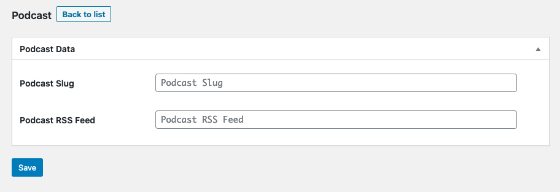
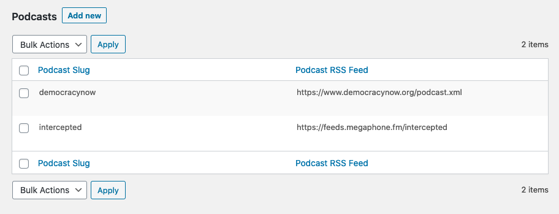
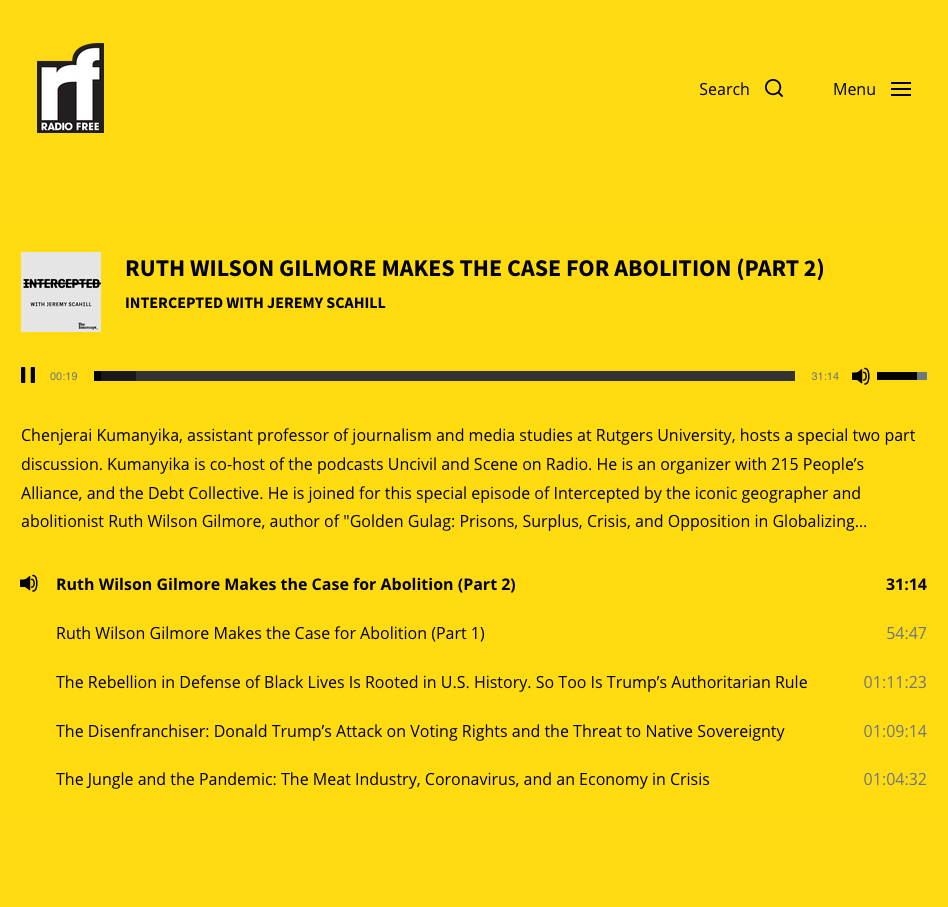

# PodcastList
A plugin heavily based on Custom List Table With Db Example by Prashant Baldha that enables you to post podcasts and display them using the Jetpack plugin "Podcast Audio" gutenberg block.  It adds the ability to see any podcast added to the list on the frontend, example.com/podcast/?podc= [Podcast Slug] set on the list on admin side.  

## Installation
### 1-Upload this zip to WordPress
### 2-Activate Plugin
### 3-Make sure Jetpack is Active
### 4-Add a feed/slug to the list on WordPress Admin backend
### 5-Check on forntend: example.com/podcast/?podc= [Podcast Slug]

